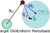

A velocity-controlled point-mass with state $\rvx$ (cartesian position) must be driven into a target disk of radius $r^* = 0.01$ m at the origin and held there.
Given a velocity command $\rvu$, the system evolves as $\dot{\rvx} = \rvv$ with $\rvv \sim B_\epsilon(\rvu) := \{ \rvv : ||\rvv - \rvu||_2 \leq \eps ||\rvu||_2 \}$ ($\eps = 0.25$ in our experiments).
The actuation noise grows with the commanded speed, so slowing down ($\rvu \to \mathbf{0}$) allows the controller to suppress actuation noise.
The controller, operating at 50 Hz, is scored by its dwell time inside the target for rollouts of length $H = 500$ steps (10 s) from states on the unit circle:
$$\rmJ(\pi) = \E_{\pi,\,\{\rvx_0 : ||\rvx_0||_2 = 1\}}\left[ \sum_{t=0}^H \Ind{||\rvx_t||_2 < r^*} \right]$$

::: {.column-margin}
{width=100%}
:::

Fixing a coordinate system XY, the robot can move at most 1 m/s in either direction, so the action space is $\gA = [-1, 1]^2$.
@fig-p2d-oracle illustrates a quiver plot of an oracle policy that has access to the perfect state $\rvx$.
The policy commands the maximum possible velocity towards the target when outside the disk, and starts slowing down to zero as it enters the target disk.
The oracle policy achieves a performance of $\rmJ_\text{oracle} = 456.23 \pm 4.59$ ($N=1000$).

{#fig-p2d-oracle}

**Sensors** The designer can equip the various controller modes with the following sensor types. Each sensor reveals a different slice of the robot's position $\rvx$, as illustrated in @fig-p2d-sensors .

- `Cartesian` (`GPS`): noisy position $\rvx + \gN(0, \sigma_\text{xy}^2 \mI_2)$, with $\sigma_\text{xy} \in \{0,\,10^{-2},\,5{\cdot}10^{-2},\,10^{-1},\,5{\cdot}10^{-1}\}$.

- `Radial` & `Sector` (`RadialSector`): a discretized polar reading returning the active sector among $s \in [1,360]$ equiangular sectors (optionally offset by $\phi$ radians) and the active radial band among $\text{len}(\rvd){+}1$ bands defined by increasing distance thresholds $\rvd = (d_1, \dots) \le 1$.
    + The per-step output is a concatenation of the one-hot over radial bands (empty when $\rvd = ()$) and unit-vector $(\cos\theta_s,\sin\theta_s)$ corresponding to centroid of the active sector.
    + There is some Gaussian noise in measuring the polar coordinates of the robot $(r, \theta)$.
        * The noise scales are tunable with $\sigma_\theta \in \{0,\,10^{-1},\,2{\cdot}10^{-1},\,4{\cdot}10^{-1},\,8{\cdot}10^{-1}\}$ and $\sigma_r \in \{0,\,10^{-2},\,5{\cdot}10^{-2},\,10^{-1}\}$.

The designer's goal is to meet a performance target $\rmJ_\text{target}$ while minimizing the sensing cost incurred.

::: {#fig-p2d-sensors .column-page}

::: {#p2d-sensors}
:::

```{=html}
<script src="assets/point-to-disk/sensor_viz.js"></script>
```

Interactive visualization of sensors for the `point-to-disk` task. Configure the parameters of `RadialSector` (left) and `GPS` (right) and click inside the unit circle (dashed line) to probe the robot's instantaneous observation. The visualization depicts the costs of the configurations under the cost-structures CheapGPS and CostlyGPS on the top. The cost difference between the `RadialSector` (left) and `GPS` (right) configurations is depicted in the center, with a <span style="color:rgb(139, 26, 26)">RED</span> background indicating a cheaper `RadialSector` configuration.

:::
